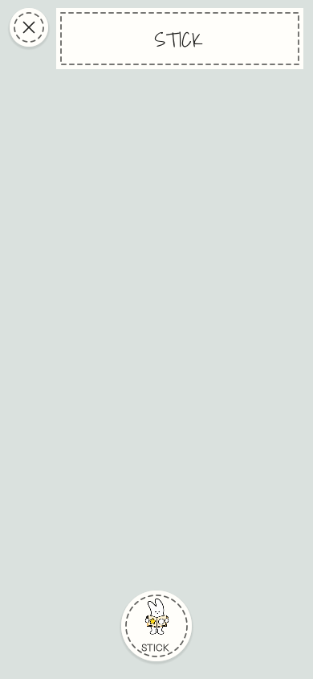
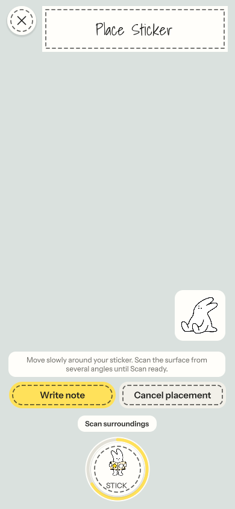
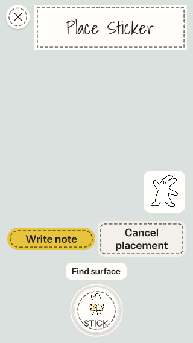

# Stick Camera controls

Verified on 2026-09-26 with Unity 6000.5.5f1. STICK is centered on a transparent dock; a non-interactive ring follows the four existing placement stages. Secondary actions sit above it.

## Results

- Regression first failed on the old layout: button center x=68 versus camera center x=195.
- PaperVisualTests and HomeLibraryVisualTests: 24 passed, 0 failed.
- Edit Mode suite: 217 passed, 0 failed.
- Final camera flow rerun with explicit 0, 1/3, 2/3, and full ring assertions: 1 passed, 0 failed.
- Reviewed normal 390×844 and compact 320×568 captures, including enlarged text and reduced motion. Inventory reopening, tracking interruption, note access, cancellation, selected-artwork access, and recovery layout remain covered.

These are graphics-enabled Unity Play Mode captures with simulated camera imagery, not physical-device AR verification. A subsequent signed iPhone build was installed and launched on Dawg. (iPhone 15 Pro Max); see [device verification](../../DEVICE_VERIFICATION.md#stick-camera-controls--2026-09-26). Physical UI and AR interaction checks remain pending.

## Commands

Run from the repository root:

```sh
/Applications/Unity/Hub/Editor/6000.5.5f1/Unity.app/Contents/MacOS/Unity \
  -batchmode -projectPath "$PWD" -buildTarget StandaloneOSX \
  -runTests -testPlatform PlayMode \
  -testFilter 'Tagtag.Tests.PaperVisualTests;Tagtag.Tests.HomeLibraryVisualTests' \
  -testResults /tmp/tagtag-stick-green.xml -logFile /tmp/tagtag-stick-green.log

/Applications/Unity/Hub/Editor/6000.5.5f1/Unity.app/Contents/MacOS/Unity \
  -batchmode -nographics -projectPath "$PWD" -buildTarget iOS \
  -runTests -testPlatform EditMode \
  -testResults /tmp/tagtag-stick-editmode.xml -logFile /tmp/tagtag-stick-editmode.log
```

The final focused rerun uses the Play Mode command with `-testFilter Tagtag.Tests.PaperVisualTests.CameraInventoryFlowUsesFullScreenAndExplicitPlacement`.

## Captures

| Idle | Scanning surroundings | Compact, enlarged text |
| --- | --- | --- |
|  |  |  |
