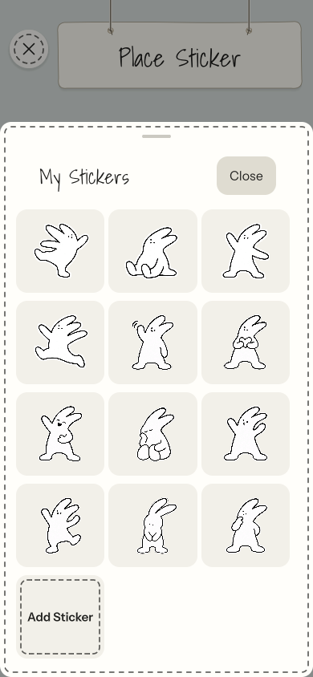
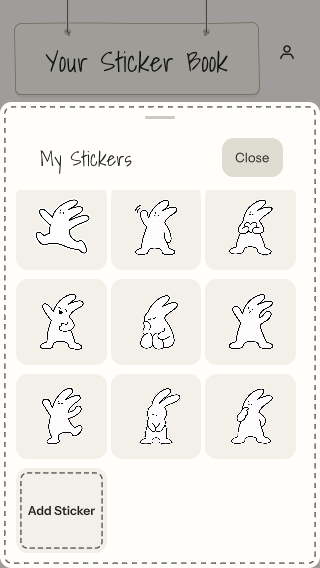

# Twelve Taggi presets

Verified on 2026-09-26 with Unity 6000.5.5f1 in an isolated project copy at
`/tmp/tagtag-twelve-tests`. Existing IDs and artwork `taggi-1` through `taggi-4`
are unchanged. Eight generated emotion poses extend the catalog to `taggi-12`.

## Results

- Regression tests first failed on selection of `taggi-5` and its accessible
  name, then passed after introducing the shared preset catalog.
- Full Edit Mode suite: **227 passed, 0 failed**.
- `PaperVisualTests` and `StickerRenderTests`: **17 passed, 0 failed** after
  updating the saved-design inventory count and allowing deferred AR test
  objects to be destroyed between cases.
- After the requested alpha-fringe cleanup: **7 passed, 0 failed** for
  `StickerRenderTests`, `CompactInventoryScrollsToTwelfthStickerAndAddSticker`,
  and `CameraInventoryFlowUsesFullScreenAndExplicitPlacement`.
- Backend `npm test`: **82 passed, 0 failed, 1 emulator-only test skipped**.
  Tests publish/collect all twelve exact IDs and verify NFT mapping to original
  variants 0–3 for the first four, generic variant 0 for the new eight.
- Independent artwork inspection confirms transparent PNGs with no alpha values
  from 1 through 15. New poses have one connected opaque silhouette, except
  waving Taggi's intentional detached motion marks. RGB and alpha values of at
  least 16/255 were unchanged by cleanup.

The 320×568 inventory scroll test exposes both the twelfth sticker and the
Add Sticker tile, and selects Thinking Taggi successfully. AR tests select every
catalog entry and verify its actual texture; unknown IDs are rejected.

## Reproduce

Run the README Unity command with `-buildTarget StandaloneOSX` and
`-testPlatform EditMode`. For graphics checks, omit `-nographics`, use
`-testPlatform PlayMode`, and pass
`-testFilter 'Tagtag.Tests.PaperVisualTests;Tagtag.AR.PlayMode.Tests.StickerRenderTests'`.
Run `cd backend && npm test` for API and souvenir mapping.

## Release and device checks

Backend support is deployed; see [deployment](../../DEPLOYMENT.md#twelve-taggi-presets-rollout).
NFT minting remains disabled. Both publishing and collecting clients need the
updated app to render the eight new bundled images; older clients only contain
the original four. No contract or metadata deployment is needed.

Physical-device placement, relocalization, publishing, and collection of the new
poses have not been tested in this task. On an iPhone, scroll to `taggi-12`, place
and publish it, then recover and collect it on another updated phone. Check the
white cut edge against a dark camera scene. Record device results in
[device verification](../../DEVICE_VERIFICATION.md).
